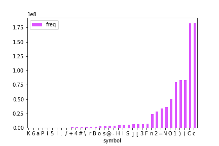
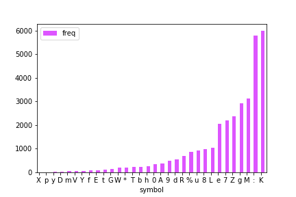
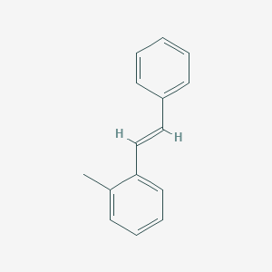

# Building a scalable database of chemical names and structures from simplified molecular-input line-entry system (SMILES) strings 
## Carly Wolfbrandt

### Table of Contents
1. [Introduction](#Introduction)
    1. [Skeletal Formulas](#skeletal_formulas) 
    2. [SMILES](#SMILES)
2. [Background](#Background)
3. [Question](#Question)
4. [Data](#Data)
    1. [Cleaning the SMILES Data](#smiles_data)
    2. [Matching SMILES Strings to Skeletal Formulas](#skeletal_images)
    3. [Matching SMILES Strings to IUPAC Names](#iupac_names)
    4. [Gathering Relevant Metadata](#metadata)

## Introduction 

### Skeletal Formulas 

The skeletal formula of a chemical species is a type of molecular structural formula that serves as a shorthand representation of a molecule's bonding and contains some information about its molecular geometry. It is represented in two dimensions, and is usually hand-drawn as a shorthand representation for sketching species or reactions. This shorthand representation is particularly useful in that carbons and hydrogens, the two most common atoms in organic chemistry, don't need to be explicitly drawn. These structural formulas contain the same information that the SMILES strings contain, but are depicted in a different way.

**Table 1**: Examples of different chemical species' names, molecular formulas and skeletal formulas

| Common Name      | IUPAC Name |Molecular Formula | Skeletal Formula | 
| :-----------: | :-----------:| :-----------: | :----------:| 
| ethanol      |  ethanol | CH3CH2OH |  |
| acetic acid   | ethanoic acid | CH3COOH  ||
|benzene | cyclo-hex-1,3,5-triene | C6H6 |  |
|cyclohexane | cyclohexane | C6H12|   |
| diphenylmethane | 1,1'-methylenedibenzene | (C6H5)2CH2||

### Simplified Molecular-Input Line-Entry System (SMILES) 

SMILES is a line notation for describing the structure of chemical elements or compounds using short ASCII strings. These strings can be thought of as a language, where atoms and bond symbols make up the vocabulary. 

SMILES strings use atoms and bond symbols to describe physical properties of chemical species in the same way that a drawing of the structure conveys information about elements and bonding orientation. This means that the SMILES string for each molecule is synonymous with its structure and since the strings are unique, the name is universal. These strings can be imported by most molecule editors for conversion into other chemical representations, including structural drawings and spectral predictions. 

**Table 2**: SMILES strings contrasted with skeletal formulas

| Common Name      | IUPAC Name |Molecular Formula | Skeletal Formula |  SMILES String |
| :-----------: | :-----------:| :-----------: | :----------:| :----------:|
| ethanol      |  ethanol | CH3CH2OH |  | CCO|
| acetic acid   | ethanoic acid | CH3COOH  || CC(=O)O |
|benzene | cyclo-hex-1,3,5-triene | C6H6 |  | c1ccccc1  |
|cyclohexane | cyclohexane | C6H12|   | C1CCCCC1 | 
| diphenylmethane | 1,1'-methylenedibenzene |(C6H5)2CH2||C1=CC=C(C=C1)CC2=CC=CC=C2|

Perhaps the most important property of SMILES, as it relates to data science, is that the data is quite compact compared to other methods. For example, SMILES structures are around 1.6 bytes per atom, on average. This is quite small, especially when compared to standard skeletal image files, which have an averge size of 4.0 kilobytes.

## Background 
“Is there a Crisis in Organic Chemistry Education?” This provocatively titled session from the 2016 American Chemical Society national meeting drew attention from many in attendance. In fact, this question continues to be a polarizing topic of conversation in chemical education. 
 
On one side are those who work in academic publishing, who believe that the wealth of textbooks, electronic study guides, and databases with tens of thousands of questions mean that students are able to learn more quickly and more thoroughly. 
 
On the other side are educators, who assert that there is so much information to be learned, it is akin to drinking from a firehose. This fast pace leaves students feeling overwhelmed, and forces them into memorization mode. In fact, research about how students learn supports this stance. James Stigler, a UCLA professor who has been studying this crisis of memorization since the 1970’s, has shown that American students think learning math and science is about memorizing procedures. “They're not learning in a deep way… Students need practice in the things they can't learn by doing a Google search.”
 
How do we lighten the load of the traditional organic chemistry curriculum so students have time to practice problems that can’t be learned through a Google search?  We can begin by unburdening students with needless memorization, and thus leave more time and mental resources for deep learning. A quick Google search of “what to memorize for organic chemistry” shows that, while many educators agree that a deep understanding is not achieved through memorization, there are some things that “just need to be memorized.” At the top of almost every “need to memorize” list is how to name chemical structures. How do we alleviate the need to memorize these naming conventions, and thus eliminate weeks of lectures and homework in a traditional organic chemistry curriculum? 
 
Machine learning of course! An image captioning model for organic chemical structures using a stacked CNN-LSTM would make it possible to get the name of any known chemical structure just from an image. This is a particularly attractive solution, since nearly every student has a phone in their pocket with a camera on them at all times. No need to draw the structure using bulky software and upload the image into an unintuitive online portal, just take a photo of the structure in question and pass it through the model. By removing memorization of naming conventions from the curriculum, students could shift their focus to novel problems that can’t be solved through a quick Google search.

## Question 
Can I build a database of unique SMILES text targets, each corresponding to a unique element or molecule, and use those to obtain chemical names and images of each molecule?

## Data 
I used a combination of sources to get my data, starting with [eMolecules](https://www.emolecules.com) for the unique SMILES strings followed by querying [PubChem](https://pubchem.ncbi.nlm.nih.gov/) for skeletal formulasand IUPAC names. 

### Cleaning the SMILES Data  
This data was available to download for free, and contained 22,327,838 unique SMILES strings.

**Table 3**: Example rows from SMILES data

| isosmiles      | version_id | parent_id | 
| :-----------: | :-----------:| :-----------: |
| c1ccccc1      |  479848 | 479848 |
| Cc1ccccc1C      |  299961464 | 299961464 |
| CCc1ccccc1      |  475202 | 475202 |
| BB      |  987804	 | 987804|
| [W]      |  481713 | 481713 |

Since my goal was to have a dataset of only hydrocarbons (compounds containing only hydrogen and carbon), I began by investigating at what frequency each element occured in the dataset. Since the frequency of elements in the SMILES dataset is correlated to the actual abundance of compounds containing each element, I expected carbon and hydrogen to be the most abundant elements. 

Looking at the frequency of each element and symbol in the data, this assumption was correct. Since the scale varied from 1000 to 1.75 x 108, I broke down the frequency into two graphs.

**Figure 1**: Frequency of the most abundant elements and symbols

It is indeed true that the elements corresponding to organic molecules are the most abundant, with carbon (C and c), hydrogen (H), nitrogen (N) and oxygen (O) occuring in almost every compound.

**Figure 2**: Frequency of the rarer elements and symbols
On the low end are rare elements, such as elemental tungsten. 

After learning what the data looks like, I removed all rows containing elements other than hydrogen and carbon. Doing so shrunk my dataset down to a more manageable 2,135 rows.

### Matching SMILES Strings to Skeletal Formulas 

With my hydrocarbon dataset, I was now able to query [PubChem](https://pubchem.ncbi.nlm.nih.gov/) for the skeletal formulas. The URLs containing each image are easy to generate, as they all follow the same format. Each URL generated a .png image file of each molecule, which I downloaded and added to the dataset.

| SMILES      | Image URL | Skeletal Formula | 
| :-----------: |:-----------: | :-----------: |
|C=CCC1(CC=C)c2ccccc2-c2ccccc12| https://pubchem.ncbi.nlm.nih.gov/rest/pug/compound/smiles/C=CCC1(CC=C)c2ccccc2-c2ccccc12/PNG | |
|Cc1ccc(C=C)c2ccccc12| https://pubchem.ncbi.nlm.nih.gov/rest/pug/compound/smiles/Cc1ccc(C=C)c2ccccc12/PNG ||
|Cc1ccccc1\C=C\c1ccccc1	|  https://pubchem.ncbi.nlm.nih.gov/rest/pug/compound/smiles/Cc1ccccc1\C=C\c1ccccc1/PNG | | 

### Matching SMILES Strings to IUPAC Names 

After the 

### Gathering Relevant Metadata 
Final paragraph
